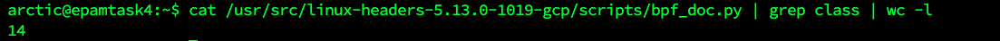

# Task4.1
## 1) and 2)
 - When password of some users will be changed, the file /etc/shadow will be changed too.


## 3) 
 
- I'd used a command 
```sh
w 
```
to determine the users who right now in system are

- This command show:
  - user login
  - the current time
  - how long the system has been running
  - how many users are currently logged on, and the system load aver‐
    ages for the past 1, 5, and 15 minutes.
- for each user: 
  - login name 
  - the tty name 
  - the remote host 
  - login time 
  - idle time 
  - JCPU 
  - PCPU 
  - the command line of their current process.

         The JCPU time is the time used by all processes attached to the tty.  It does not include past background jobs, but  does
         include currently running background jobs.

         The PCPU time is the time used by the current process, named in the "what" field  


## 4) and 5)
I've changed information about me and I've used two options for these command
```sh
usermod -s  
```
```sh
usermod -a -G
```
First options change the shell of the user, second option add the user to the supplementary group


## 6) 
```sh
more
```
This command shows a one page of file
```sh
less
```
This command is combine of two commands - vi and more

## 7)
I've used this command with option -s
```sh
finger -s jenkins
```

## 8)
Two commands with same possibility was used by me - 
```sh
tree
```
```sh
ls -la
```

# Part2
## 1)Examine the tree command.

## 2) What command can be used to determine the type of file

## 3) How can you go back to your home directory from anywhere in the filesystem?

## 4) Give examples of listing directories using different keys.

## 5) Perform the following sequence of operations:

## 6) Perform the following sequence of operations:
create a subdirectory test in the home directory;


## 7) Using the locate utility, find all files that contain the squid and traceroute sequence

## 8) Determine which partitions are mounted in the system
```sh
df -aTh
```

## 9) Count the number of lines containing a given sequence of characters in a given file.

## 10) Using the find command

## 11) List all objects in /etc that contain the ss character sequence

## 12) Organize a screen-by-screen print of the contents of the /etc directory
```sh
cat /etc/* | more
```


## 13) ) What are the types of devices and how to determine the type of device?

```sh
dmesg | less
```


## 15) * List the first 5 directory files


