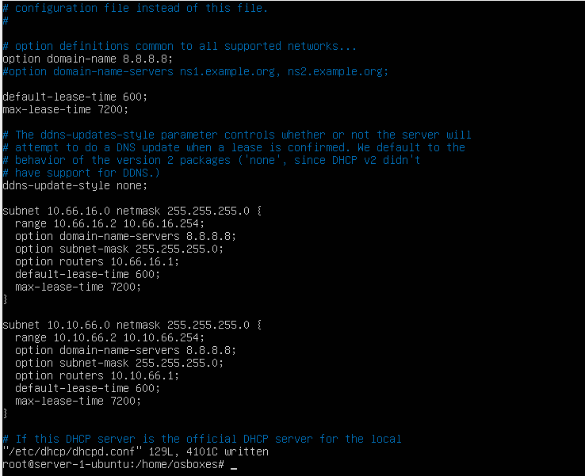

#Task 5.

####Адреса мережі Net2 – 10.Y.D.0/24, де Y – дві останні цифри з вашого року народження, D – дата народження.
####Адреса мережі Net3 – 10.M.Y.0/24, де M – номер місяця народження.
####Адреса мережі Net4 – 172.16.D.0/24.


#### 1. На Server_1 налаштувати статичні адреси на всіх інтерфейсах.


#### 2. На Server_1 налаштувати DHCP сервіс, який буде конфігурувати адреси Int1
   Client_1 та Client_2
```
C учетом того, что у нас DHCP работает по двум интерфейсам, использовал директиву 
DHCPDARGS="enp0s8 enp0s9";
```


> настройки сетевых интерфейсов на Client_1 и Client_2


#### 3. За допомогою команд ping та traceroute перевірити зв'язок між віртуальними машинами. Результат пояснити.


> Увага! Для того, щоб з Client_1 та Client_2 проходили пакети в мережу Internet (точніше щоб повертались з Internet на Client_1 та Client_2) на Wi-Fi Router необхідно налаштувати статичні маршрути для мереж Net2 та Net3


#### 4. На віртуальному інтерфейсу lo Client_1 призначити дві ІР адреси за таким
правилом: 172.17.D+10.1/24 та 172.17.D+20.1/24.


#### Налаштувати маршрутизацію таким чином, щоб трафік з Client_2 до 172.17.D+10.1 проходив через Server_1, а до 172.17.D+20.1 через Net4. Для перевірки використати traceroute.

> Чтобы пакеты проходили с одного интерфейса на другой, необходимо донастроить сервер:

```shell
sysctl -w net.ipv4.ip.forwarding = 1
```


```shell
ip route show 
```


```shell
traceroute
```


#### 5. Розрахувати спільну адресу та маску (summarizing) адрес 172.17.D+10.1 та 172.17.D+20.1, при чому маска має бути максимально можливою. Видалити маршрути, встановлені на попередньому кроці та замінити їх об’єднаним маршрутом, якій має проходити через Server_1.

```shell
net - 172.17.0.0/16
```


#### 6. Налаштувати SSH сервіс таким чином, щоб Client_1 та Client_2 могли підключатись до Server_1 та один до одного.

> Разрешил слушать на всех интерфейсах, разрешил вход рутом по ssh на Centos


#### 7. Налаштуйте на Server_1 firewall таким чином:
• Дозволено підключатись через SSH з Client_1 та заборонено з Client_2

```shell
ufw allow from 10.66.16.2 ssh
```
```shell
ufw deny from 10.10.66.2 ssh
```

• З Client_1 на 172.17.D+10.1 ping проходив, а на 172.17.D+20.1 не проходив

> Отредактировал /etc/ufw/before.rules - добавил 

```
-j DROP в цепочки INPUT и FORWARD с dst-IP
```


#### 8. Якщо в п.3 була налаштована маршрутизація для доступу Client_1 та Client_2 до мережі Інтернет – видалити відповідні записи. На Server_1 налаштувати NAT сервіс таким чином, щоб з Client_1 та Client_2 проходив ping в мережу Інтернет

> Добавил блок  *nat - COMMIT в /etc/ufw/before.rules


