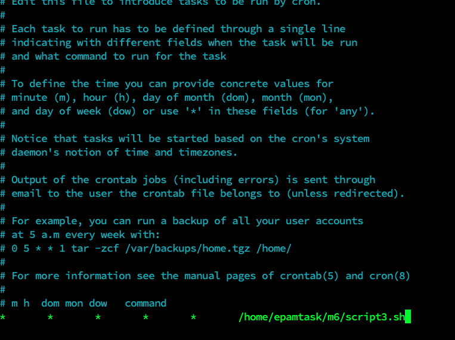

# Task 6.1

#### A. Create a script that uses the following keys:

> 1. When starting without parameters, it will display a list of possible keys and their description.
> 2. The --all key displays the IP addresses and symbolic names of all hosts in the current subnet
> 3. The --target key displays a list of open system TCP ports.
>    The code that performs the functionality of each of the subtasks must be placed in a separate function

```
#!/bin/bash
function all {  
                echo Please wait some time 
                address=`ip a | grep inet | fgrep -v inet6 | fgrep -v 127.0.0.1 | awk '{print $2}'`
                for i in $address
                do
                        MASK=${i##*/}
                        NETWORK=${i%.*}
                        RESULT=$NETWORK".0/"$MASK
                        nmap -sP -PR $RESULT | awk '{print $5 $6}' | fgrep -v latency | fgrep -v address
                done
}

function target() {
                echo At your machine next ports are opened:
                netstat -lntu | egrep tcp | egrep -v tcp6 | awk '{print $4}' | awk -F ':' '{print $2}'
}

function anything {
                echo You must use options \"--all\" or \"--target\"
}
case $1 in
        --all)  
                all
                ;;
        --target)
                target
                ;;
        *)
                anything
                ;;
esac
```

---


#### B. Using Apache log example create a script to answer the following questions:

> 1. From which ip were the most requests?
> 2. What is the most requested page?
> 3. How many requests were there from each ip?
> 4. What non-existent pages were clients referred to?
> 5. What time did site get the most requests? 6. What search bots have accessed the site? (UA + IP)

```
#!/bin/bash
echo From which ip were the most requests?
cat apache_logs.txt | awk '{print $1}' | sort | uniq -c | sort -rnk1 | head -1

echo What is the most requested page? 
cat apache_logs.txt | awk '{print $7}' | sort | uniq -c | sort -rnk1 | head -3

echo How many requests were there from each ip? 
cat apache_logs.txt | awk '{print $1}' | sort | uniq -c | sort -rnk1

echo What non-existent pages were clients referred to? 
egrep 'error404' apache_logs.txt | awk '{print $7}' | sort | uniq -c | sort -rnk1

echo What time did site get the most requests? 
cat apache_logs.txt | awk '{print $4}' | awk -F '/' '{print $3}' | awk '{print $1}' |  sort | uniq -cd | sort -rnk1 | head -5

echo What search bots have accessed the site \(UA + IP\)?

echo bingbot
cat apache_logs.txt | egrep bingbot | awk '{print $1}' | sort | uniq -d 

```

---


#### C. Create a data backup script that takes the following data as parameters:

> 1. Path to the syncing  directory.
> 2. The path to the directory where the copies of the files will be stored.
> In case of adding new or deleting old files, the script must add a corresponding entry to the log file indicating the time, type of operation and file name. [The command to run the script must be added to crontab with a run frequency of one minute]

```
#!/bin/bash
cd /home/epamtest
[ -d /tmp/backup ] || /usr/bin/mkdir /tmp/backup
f=`/usr/bin/ls -S`
for i in $f 
    do
        if ! /usr/bin/cmp -s $i /tmp/backup/$i ; then
            /usr/bin/cp $i /tmp/backup/
            /usr/bin/echo `date` - updated - $i >> /tmp/tmp.log
        fi
    done

cd /tmp/backup
[ -d /tmp/backup ] || /usr/bin/mkdir /tmp/backup
f=`/usr/bin/ls -S`
for i in $f 
    do
       [ -f /home/epamtest/$i ] || /usr/bin/rm /tmp/backup/$i
       /usr/bin/echo `date` - deleted - $i >> /tmp/tmp.log
    done
    
```


