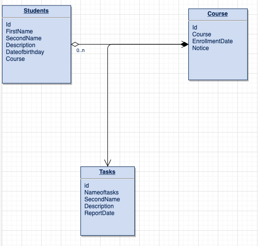
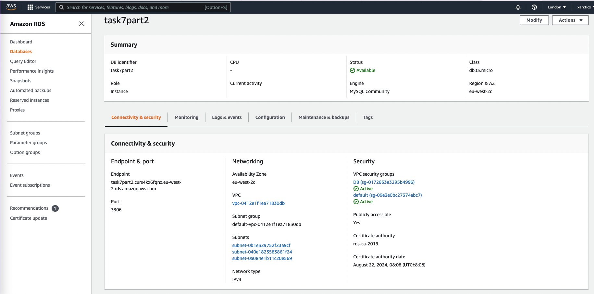
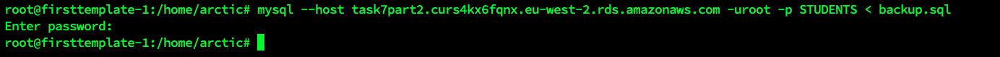
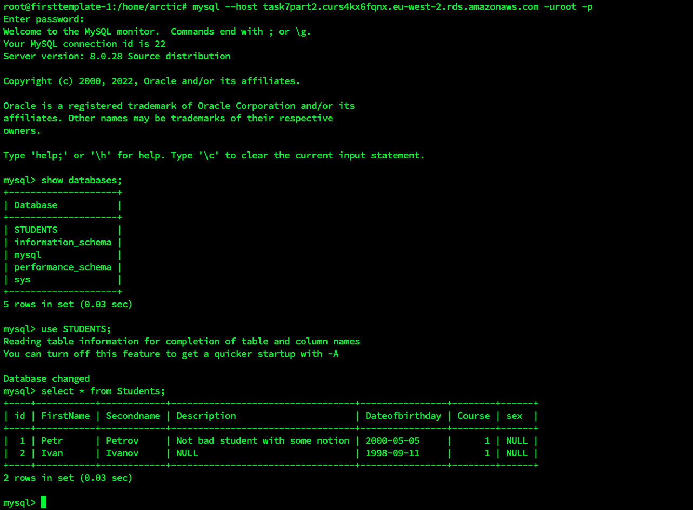
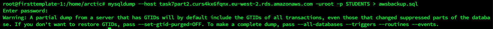
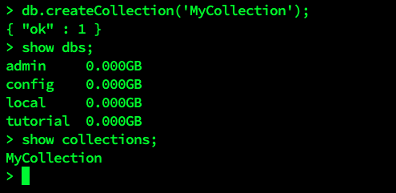
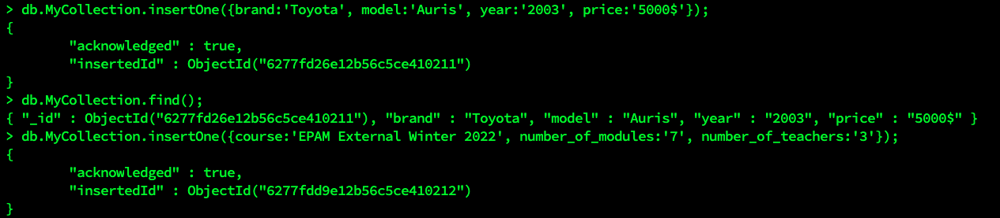
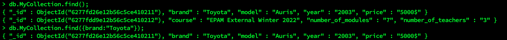

# Task 7.1

### PART 1

1. DownloadMySQL server for your OS on VM.
2. Install MySQL server on VM.

   ```
   docker run --name=mysql1 --restart on-failure -d mysql/mysql-server:8.0

   arctic@firsttemplate-1:~$ docker ps -a
   CONTAINER ID   IMAGE                    COMMAND                  CREATED              STATUS                                  PORTS                       NAMES
   473e165ce50d   mysql/mysql-server:8.0   "/entrypoint.sh mysq…"   6 seconds ago        Up 3 seconds (health: starting)         3306/tcp, 33060-33061/tcp   mysql1

   docker logs mysql1 2>&1 | grep GENERATED
   [Entrypoint] GENERATED ROOT PASSWORD: 96iL1vi5Fwj48se2^Q#q/j

   arctic@firsttemplate-1:~$ docker exec -it mysql1 mysql -uroot -p
   Enter password:
   Welcome to the MySQL monitor.  Commands end with ; or \g.
   Your MySQL connection id is 12
   Server version: 8.0.29

   Copyright (c) 2000, 2022, Oracle and/or its affiliates.

   Oracle is a registered trademark of Oracle Corporation and/or its
   affiliates. Other names may be trademarks of their respective
   owners.

   Type 'help;' or '\h' for help. Type '\c' to clear the current input statement.

   mysql>
   ```
3. Select a subject area and describe the database schema, (minimum 3 tables)




4. Create a database on the server through the console.

```
mysql> CREATE DATABASE STUDENTS;
Query OK, 1 row affected (0.01 sec)

mysql> show databases;
+--------------------+
| Database           |
+--------------------+
| STUDENTS           |
| information_schema |
| mysql              |
| performance_schema |
| sys                |
+--------------------+
5 rows in set (0.00 sec)
mysql> use STUDENTS;
Database changed

mysql> create table Students
    -> (id INT NOT NULL AUTO_INCREMENT,
    -> FirstName MEDIUMTEXT,
    -> Secondname MEDIUMTEXT, 
    -> Description LONGTEXT,
    -> Dateofbirthday DATE,
    -> Course INT,
    -> PRIMARY KEY (id),
    -> index (id));
Query OK, 0 rows affected (0.03 sec)

mysql> show tables;+--------------------+
| Tables_in_STUDENTS |
+--------------------+
| Students           |
+--------------------+
1 row in set (0.00 sec)
mysql> create table Course (id INT NOT NULL AUTO_INCREMENT, Course MEDIUMTEXT, Enrollmentdate DATE, Notice Longtext, PRIMARY KEY (id), index (id));Query OK, 0 rows affected (0.02 sec)

mysql> create table Tasks (id INT NOT NULL AUTO_INCREMENT, Course INT, Nameoftasks MEDIUMTEXT, Secondname INT, Description Longtext, Reportdate DATE, PRIMARY KEY
(id), index (id));
Query OK, 0 rows affected (0.02 sec)

mysql> show tables;
+--------------------+
| Tables_in_STUDENTS |
+--------------------+
| Course             |
| Students           |
| Tasks              |
+--------------------+
3 rows in set (0.00 sec)

```

5. Fill in tables.

```
mysql> insert into Course (course, Enrollmentdate, Notice) values ('DevopsExternalWinter2022', '2022-01-17', 'Best course');
Query OK, 1 row affected (0.01 sec)

mysql> select * from Course;
+----+--------------------------+----------------+-------------+
| id | Course                   | Enrollmentdate | Notice      |
+----+--------------------------+----------------+-------------+
|  1 | DevopsExternalWinter2022 | 2022-01-17     | Best course |
+----+--------------------------+----------------+-------------+
1 row in set (0.00 sec)

mysql> insert into Students (firstname, secondname, dateofbirthday) value ('Petr', 'Petrov', '2000-05-05');
Query OK, 1 row affected (0.01 sec)
mysql> insert into Students (firstname, secondname, dateofbirthday) value ('Ivan', 'Ivanov', '1998-09-11');
Query OK, 1 row affected (0.01 sec)

mysql> update Students, (select id from Course where Course='DevopsExternalWinter2022') as idcourse set Students.Course=idcourse.id where Students.Secondname='Iva
nov';
Query OK, 1 row affected (0.01 sec)
Rows matched: 1  Changed: 1  Warnings: 0

mysql> update Students, (select id from Course where Course='DevopsExternalWinter2022') as idcourse set Students.Course=idcourse.id where Students.Secondname='Petrov';
Query OK, 1 row affected (0.00 sec)
Rows matched: 1  Changed: 1  Warnings: 0

mysql> update Students set Description='Not bad student with some notion' where Secondname='Petrov';
Query OK, 1 row affected (0.00 sec)
Rows matched: 1  Changed: 1  Warnings: 0

mysql> select * from Students;+----+-----------+------------+----------------------------------+----------------+--------+
| id | FirstName | Secondname | Description                      | Dateofbirthday | Course |
+----+-----------+------------+----------------------------------+----------------+--------+
|  1 | Petr      | Petrov     | Not bad student with some notion | 2000-05-05     |      1 |
|  2 | Ivan      | Ivanov     | NULL                             | 1998-09-11     |      1 |
+----+-----------+------------+----------------------------------+----------------+--------+
2 rows in set (0.00 sec)
mysql> insert into Tasks (course, Nameoftasks, Secondname, ReportDate) values ((select id from Course where Course='DevopsExternalWinter2022'), 'Task7.1', (select id from Students where Secondname='Petrov'), NOW());
Query OK, 1 row affected, 1 warning (0.01 sec)

mysql> select * from Tasks;+----+--------+-------------+------------+-------------+------------+
| id | Course | Nameoftasks | Secondname | Description | Reportdate |
+----+--------+-------------+------------+-------------+------------+
|  1 |      1 | Task7.1     |          1 | NULL        | 2022-05-08 |
+----+--------+-------------+------------+-------------+------------+
1 row in set (0.00 sec)
```

6. Construct and execute SELECT operator with WHERE, GROUP BY and ORDER BY.

```
mysql> select Course, count(*) as CourseCount from Students GROUP BY Course;
+--------+-------------+
| Course | CourseCount |
+--------+-------------+
|      1 |           2 |
|      2 |           1 |
+--------+-------------+
2 rows in set (0.00 sec)

mysql> select Course, count(*) as CourseCount from Students GROUP BY Course ORDER BY Course desc;
+--------+-------------+
| Course | CourseCount |
+--------+-------------+
|      2 |           1 |
|      1 |           2 |
+--------+-------------+
2 rows in set (0.00 sec)
```

7. Execute other different SQL queries DDL, DML, DCL

```
#### DDL:
mysql> alter table Students add column sex text;
Query OK, 0 rows affected (0.01 sec)

mysql> show columns from Students;
+----------------+------------+------+-----+---------+----------------+
| Field          | Type       | Null | Key | Default | Extra          |
+----------------+------------+------+-----+---------+----------------+
| id             | int        | NO   | PRI | NULL    | auto_increment |
| FirstName      | mediumtext | YES  |     | NULL    |                |
| Secondname     | mediumtext | YES  |     | NULL    |                |
| Description    | longtext   | YES  |     | NULL    |                |
| Dateofbirthday | date       | YES  |     | NULL    |                |
| Course         | int        | YES  |     | NULL    |                |
| sex            | text       | YES  |     | NULL    |                |
+----------------+------------+------+-----+---------+----------------+
7 rows in set (0.01 sec)

mysql> create table TEST (id INT);
Query OK, 0 rows affected (0.01 sec)

mysql> rename table TEST to EXAMPLE;
Query OK, 0 rows affected (0.01 sec)
mysql> drop table EXAMPLE;
Query OK, 0 rows affected (0.01 sec)

### DML

mysql> delete from Students where FirstName='John';
Query OK, 1 row affected (0.00 sec)

### DCL

```

8.Create a database of new users with different privileges. Connect to the databaseas a new user and verify that the privileges allow or deny certain actions.

```
mysql> create user 'epam'@'localhost' identified by '1234556';
Query OK, 0 rows affected (0.00 sec)

mysql> grant select on STUDENTS.Students to 'epam'@'localhost';
Query OK, 0 rows affected, 1 warning (0.01 sec)

arctic@firsttemplate-1:~$ docker exec -it mysql1 mysql -uepam -p
Enter password:
Welcome to the MySQL monitor.  Commands end with ; or \g.
Your MySQL connection id is 439
Server version: 8.0.29 MySQL Community Server - GPL

Copyright (c) 2000, 2022, Oracle and/or its affiliates.

Oracle is a registered trademark of Oracle Corporation and/or its
affiliates. Other names may be trademarks of their respective
owners.

Type 'help;' or '\h' for help. Type '\c' to clear the current input statement.

mysql> use STUDENTS;
Reading table information for completion of table and column names
You can turn off this feature to get a quicker startup with -A

Database changed
mysql> show tables;
+--------------------+
| Tables_in_STUDENTS |
+--------------------+
| Students           |
+--------------------+
1 row in set (0.01 sec)

mysql> insert into Students (FirstName, SecondName, Description, Dateofbirthday, Course) values ('John', 'White', 'Foreign student', '2001-01-02', 2);
ERROR 1142 (42000): INSERT command denied to user 'epam'@'localhost' for table 'Students'
mysql> create table NEW;
ERROR 1142 (42000): CREATE command denied to user 'epam'@'localhost' for table 'NEW'
mysql> 

mysql> select * from Students where Firstname like 'Ivan';
+----+-----------+------------+-------------+----------------+--------+------+
| id | FirstName | Secondname | Description | Dateofbirthday | Course | sex  |
+----+-----------+------------+-------------+----------------+--------+------+
|  2 | Ivan      | Ivanov     | NULL        | 1998-09-11     |      1 | NULL |
+----+-----------+------------+-------------+----------------+--------+------+
1 row in set (0.00 sec)

```

9. Make a selection from the main table DB MySQL.

```
mysql> use mysql;
mysql> show tables;
+------------------------------------------------------+
| Tables_in_mysql                                      |
+------------------------------------------------------+
| columns_priv                                         |
| component                                            |
| db                                                   |
| default_roles                                        |
| engine_cost                                          |
| func                                                 |
| general_log                                          |
| global_grants                                        |
| gtid_executed                                        |
| help_category                                        |
| help_keyword                                         |
| help_relation                                        |
| help_topic                                           |
| innodb_index_stats                                   |
| innodb_table_stats                                   |
| password_history                                     |
| plugin                                               |
| procs_priv                                           |
| proxies_priv                                         |
| replication_asynchronous_connection_failover         |
| replication_asynchronous_connection_failover_managed |
| replication_group_configuration_version              |
| replication_group_member_actions                     |
| role_edges                                           |
| server_cost                                          |
| servers                                              |
| slave_master_info                                    |
| slave_relay_log_info                                 |
| slave_worker_info                                    |
| slow_log                                             |
| tables_priv                                          |
| time_zone                                            |
| time_zone_leap_second                                |
| time_zone_name                                       |
| time_zone_transition                                 |
| time_zone_transition_type                            |
| user                                                 |
+------------------------------------------------------+

mysql> show columns from user;
mysql> select password_expired from user;
+------------------+
| password_expired |
+------------------+
| N                |
| N                |
| N                |
| N                |
| N                |
| N                |
+------------------+
6 rows in set (0.01 sec)

```

### PART 2

10.Make backup of your database.

```
docker exec -it mysql1 bash
bash-4.4# mysqldump -u root -p STUDENTS > /tmp/backup.sql
Enter password: 

bash-4.4# ls -la /tmp/backup.sql 
-rw-r--r-- 1 root root 3780 May  8 14:06 /tmp/backup.sql


```

11.Delete the table and/or part of the data in the table.

```
mysql> use STUDENTS;
Reading table information for completion of table and column names
You can turn off this feature to get a quicker startup with -A

Database changed
mysql> drop table Students;
Query OK, 0 rows affected (0.01 sec)

mysql> show tables;
+--------------------+
| Tables_in_STUDENTS |
+--------------------+
| Course             |
| Tasks              |
+--------------------+
2 rows in set (0.00 sec)

```

12.Restore your database.

```
mysql> source /tmp/backup.sql
mysql> show tables;
+--------------------+
| Tables_in_STUDENTS |
+--------------------+
| Course             |
| Students           |
| Tasks              |
+--------------------+
3 rows in set (0.00 sec)
```

13.Transfer your local database to RDS AWS.







14.Connect to your database.

15.Execute SELECT operator similar step 6.



16.Create the dump of your database.



### PART 3–MongoDB

17.Create a database. Use the use command to connect to a new database (If it doesn't exist, Mongo will create it when you write to it).

18.Create a collection. Use db.createCollection to create a collection. I'll leave the subject up to you.Run show dbs and show collections to view your database and collections.



19.Create some documents. Insert a couple of documents into your collection. I'll leave the subject matter up to you, perhaps cars or hats.



20. Use find() to list documentsout.




